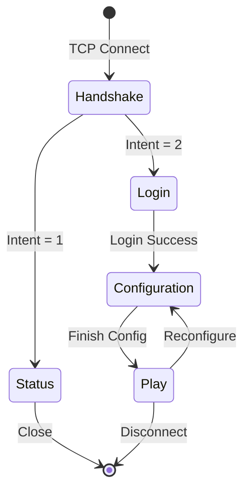
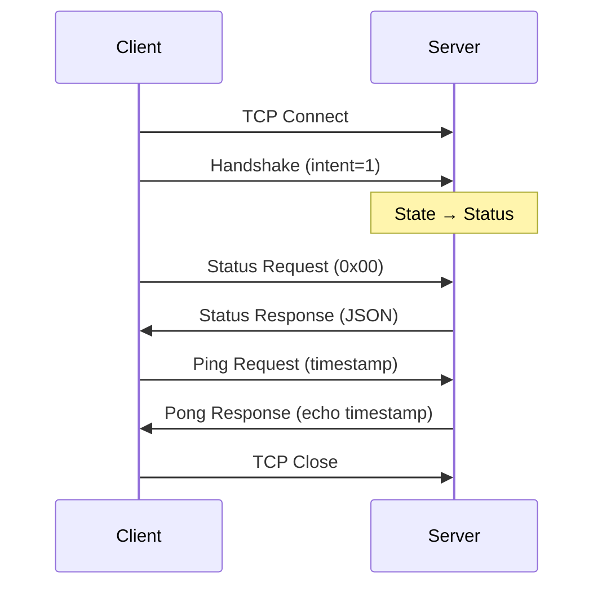
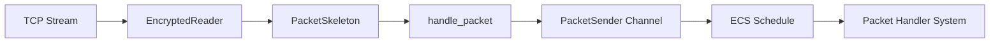
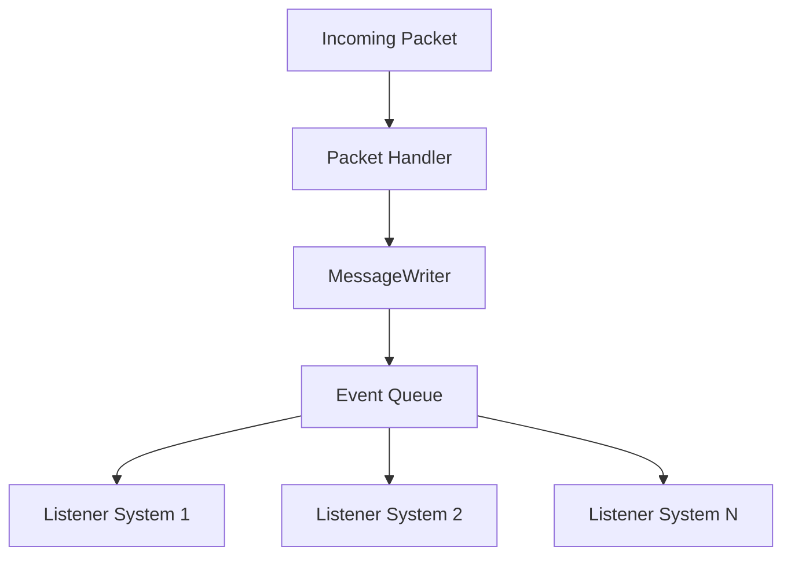

# Minecraft Protocol Flow

This document explains how ferrumc handles the Minecraft Java Edition protocol, from initial connection to gameplay.

## Overview

The Minecraft protocol is a state machine with 5 connection states:



## Connection States

| State | Purpose | Code Reference |
|-------|---------|----------------|
| **Handshake** | Initial packet determines intent | `ConnState::Handshake` in [`lib.rs`](../src/lib/net/src/lib.rs) |
| **Status** | Server list ping (MOTD, player count) | `ConnState::Status` |
| **Login** | Authentication, compression setup | `ConnState::Login` |
| **Configuration** | Registry data, resource packs | `ConnState::Configuration` |
| **Play** | Actual gameplay packets | `ConnState::Play` |

---

## Status Ping Flow

When a client pings the server (multiplayer menu), it follows this flow:



### Code Flow

1. **TCP Accept** - [`game_loop.rs`](../src/bin/src/game_loop.rs) `tcp_conn_acceptor()`
2. **Handle Connection** - [`connection.rs`](../src/lib/net/src/connection.rs) `handle_connection()`
3. **Handshake** - [`conn_init/mod.rs`](../src/lib/net/src/conn_init/mod.rs) `handle_handshake()`
4. **Status Handler** - [`conn_init/status.rs`](../src/lib/net/src/conn_init/status.rs) `status()`

### Status Response JSON

```json
{
  "version": { "name": "1.21.8", "protocol": 772 },
  "players": { "max": 100, "online": 5, "sample": [...] },
  "description": { "text": "A ferrumc server" },
  "favicon": "data:image/png;base64,...",
  "enforces_secure_chat": false
}
```

---

## Login → Play Flow

When a client actually joins the server:

```mermaid
sequenceDiagram
    participant C as Client
    participant S as Server
    
    C->>S: Handshake (intent=2)
    Note over S: State → Login
    
    rect rgb(40, 40, 60)
    Note over C,S: LOGIN STATE
    C->>S: Login Start (username, UUID)
    
    opt Encryption Enabled
        S->>C: Encryption Request
        C->>S: Encryption Response
        Note over C,S: Enable AES encryption
    end
    
    opt Compression Enabled
        S->>C: Set Compression (threshold)
        Note over C,S: Enable zlib compression
    end
    
    S->>C: Login Success (UUID, username)
    C->>S: Login Acknowledged
    end
    
    rect rgb(40, 60, 40)
    Note over C,S: CONFIGURATION STATE
    C->>S: Client Information
    S->>C: Known Packs
    C->>S: Select Known Packs
    S->>C: Registry Data (dimensions, biomes, etc.)
    S->>C: Plugin Message (brand)
    S->>C: Finish Configuration
    C->>S: Ack Finish Configuration
    end
    
    rect rgb(60, 40, 40)
    Note over C,S: PLAY STATE
    S->>C: Login (Play)
    S->>C: Player Abilities
    S->>C: Synchronize Position
    C->>S: Confirm Teleportation
    S->>C: Chunk Data...
    Note over C,S: Gameplay begins
    end
```



### Code Flow

| Step | Function | File |
|------|----------|------|
| 1. TCP Accept | `tcp_conn_acceptor()` | [`game_loop.rs`](../src/bin/src/game_loop.rs#L309) |
| 2. Connection Handler | `handle_connection()` | [`connection.rs`](../src/lib/net/src/connection.rs#L253) |
| 3. Handshake | `handle_handshake()` | [`conn_init/mod.rs`](../src/lib/net/src/conn_init/mod.rs#L60) |
| 4. Login Sequence | `login()` | [`conn_init/login.rs`](../src/lib/net/src/conn_init/login.rs#L50) |
| 5. ECS Registration | `accept_new_connections()` | [`new_connections.rs`](../src/bin/src/systems/new_connections.rs) |
| 6. Packet Loop | `handle_connection()` recv loop | [`connection.rs`](../src/lib/net/src/connection.rs#L358) |

---

## Packet Format

All packets follow this format:

### Uncompressed
```
┌──────────────┬────────────┬──────────────────┐
│ Length       │ Packet ID  │ Data             │
│ (VarInt)     │ (VarInt)   │ (varies)         │
└──────────────┴────────────┴──────────────────┘
```

### Compressed (when data length > threshold)
```
┌──────────────┬────────────────┬────────────────────────┐
│ Packet Len   │ Data Length    │ Compressed             │
│ (VarInt)     │ (VarInt)       │ (ID + Data)            │
└──────────────┴────────────────┴────────────────────────┘
```

**Compression**: Handled by [`compress_packet()`](../src/lib/net/src/compression.rs)

---

## Play State Packet Handling

Once in Play state, packets flow through the ECS:



### Key Components

| Component | Purpose | File |
|-----------|---------|------|
| `StreamWriter` | Async packet output | [`connection.rs`](../src/lib/net/src/connection.rs#L41) |
| `EncryptedReader` | AES-encrypted input | `ferrumc_net_encryption` |
| `PacketSkeleton` | Parsed packet frame | [`packet_skeleton.rs`](../src/lib/net/src/packets/incoming/packet_skeleton.rs) |
| `PacketSender` | Channel to ECS | [`lib.rs`](../src/lib/net/src/lib.rs) |

### Packet Handler Registration

Packets are dispatched via the `setup_packet_handling!` macro:

```rust
// src/lib/net/src/lib.rs
setup_packet_handling!("\\src\\packets\\incoming");
```

This generates a `handle_packet()` function that routes packets by ID to their handlers.

---

## Event System

Player actions trigger events that systems can listen to:



**Example**: Player join triggers `PlayerJoined` event:
- [`new_connections.rs`](../src/bin/src/systems/new_connections.rs) sends `PlayerJoined`
- Listeners in [`register_gameplay_listeners()`](../src/bin/src/systems/listeners/mod.rs) react

---

## Threading Model

```
┌─────────────────────────────────────────────────────────────┐
│                     MAIN THREAD                             │
│  ┌─────────────────────────────────────────────────────┐    │
│  │              Bevy ECS Scheduler                     │    │
│  │  - Tick schedule (20 TPS)                           │    │
│  │  - Keepalive schedule (1s)                          │    │
│  │  - World sync schedule (15s)                        │    │
│  └─────────────────────────────────────────────────────┘    │
└─────────────────────────────────────────────────────────────┘
                              │
                              │ crossbeam channels (incoming)
                              │ tokio mpsc channels (outgoing)
                              ▼
┌─────────────────────────────────────────────────────────────┐
│                  NETWORK THREAD (Tokio)                     │
│  ┌────────────────┐  ┌────────────────┐  ┌────────────────┐ │
│  │  TCP Acceptor  │  │ Conn Handler 1 │  │ Conn Handler N │ │
│  │  (listener)    │  │  (per player)  │  │  (per player)  │ │
│  └────────────────┘  └────────────────┘  └────────────────┘ │
└─────────────────────────────────────────────────────────────┘
```

See [`game_loop.rs`](../src/bin/src/game_loop.rs) for the threading setup.

---

## Quick Reference

### Protocol Version
- **Minecraft**: 1.21.8
- **Protocol**: 772
- **Constant**: `PROTOCOL_VERSION_1_21_8` in [`conn_init/mod.rs`](../src/lib/net/src/conn_init/mod.rs#L31)

### External References
- [Minecraft Protocol Wiki](https://minecraft.wiki/w/Java_Edition_protocol/Packets)
- [Protocol Version Numbers](https://minecraft.wiki/w/Minecraft_Wiki:Projects/wiki.vg_merge/Protocol_version_numbers)
